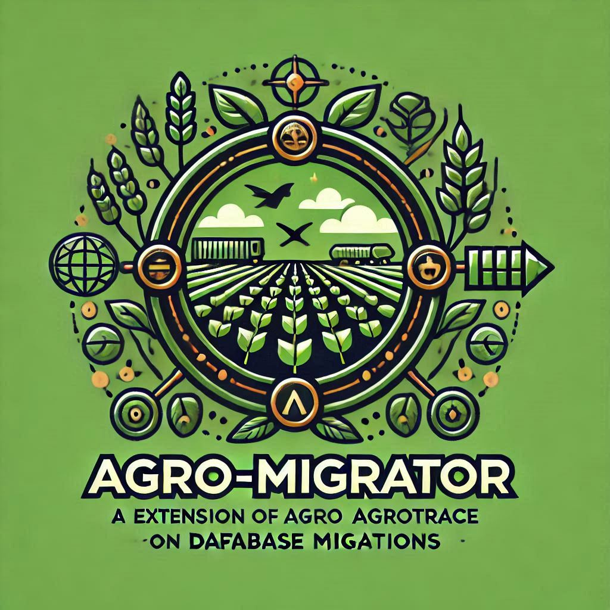

<p align="center">
    
</p>
<p align="center"><h1 align="center">AGRO-MIGRATOR</h1></p>
<p align="center">
	<em>Semear Progresso, Colher Integridade de Dados</em>
</p>
<p align="center">
	
	
	
	
</p>
<br>

<details><summary>Tabela de Conteúdos</summary>

- [📍 Visão Geral](#-visão-geral)
- [👾 Funcionalidades](#-funcionalidades)
- [📁 Estrutura do Projeto](#-estrutura-do-projeto)
  - [📂 Índice do Projeto](#-índice-do-projeto)
- [🚀 Começando](#-começando)
  - [☑️ Pré-requisitos](#-pré-requisitos)
  - [⚙️ Instalação](#-instalação)
  - [🤖 Uso](#🤖-uso)
  - [🧪 Testes](#🧪-testes)
- [📌 Planejamento do Projeto](#-planejamento-do-projeto)
- [🔰 Contribuindo](#-contribuindo)
- [🎗 Licença](#-licença)
- [🙌 Agradecimentos](#-agradecimentos)

</details>
<hr>

## 📍 Visão Geral

**Agro-Migrator** é um projeto open-source inovador projetado para simplificar migrações de banco de dados do Agrotrace. Ele oferece uma solução robusta e amigável para gerenciar estruturas complexas de bancos de dados, garantindo integridade dos dados e rastreabilidade de mudanças. Suas principais funcionalidades incluem geração automática de arquivos SQL, trilhas de auditoria abrangentes e serviços de migração personalizáveis. Ideal para desenvolvedores e administradores de banco de dados no setor agrícola que desejam aprimorar seus processos de gerenciamento de dados.

---

## 👾 Funcionalidades

|     |     Funcionalidade      | Resumo                                                                                                                                                                                                                                                                                                |
| :-- | :---------------------: | :---------------------------------------------------------------------------------------------------------------------------------------------------------------------------------------------------------------------------------------------------------------------------------------------------- |
| ⚙️  |     **Arquitetura**     | <ul><li>Usa uma combinação de TypeScript, SQL e scripts Shell.</li><li>Organizado em diretórios core, infra e utils para separação de responsabilidades.</li><li>Utiliza padrões de fábrica para criação de instâncias de migração e de construtor para construção de arquivos de migração.</li></ul> |
| 🔩  | **Qualidade do Código** | <ul><li>Práticas rigorosas de codificação via `tsconfig.json`.</li><li>Configuração de padrões de codificação e linting no `biome.json`.</li><li>TypeScript para tipagem estática e melhor qualidade de código.</li></ul>                                                                             |
| 📄  |    **Documentação**     | <ul><li>Linguagem principal: TypeScript com mix de JSON, SQL e scripts Shell.</li><li>Gerenciador de pacotes: `Bun`.</li><li>Instalação clara e comandos de uso e teste bem definidos.</li></ul>                                                                                                      |
| 🔌  |     **Integrações**     | <ul><li>Integração com `Bun` para gerenciamento de pacotes.</li><li>Conexão com banco de dados usando `mysql2`.</li><li>Integração com `typeorm` para mapeamento objeto-relacional.</li></ul>                                                                                                         |
| 🧩  |    **Modularidade**     | <ul><li>Arquitetura modular com separação clara de responsabilidades.</li><li>Interfaces para definição de tipos e serviços.</li><li>Geradores, analisadores e serviços organizados em módulos distintos.</li></ul>                                                                                   |
| 🧪  |       **Testes**        | <ul><li>Comandos de teste fornecidos via `Bun`.</li><li>Detalhes adicionais sobre os testes não mencionados no contexto atual.</li></ul>                                                                                                                                                              |
| ⚡️ |     **Desempenho**      | <ul><li>Usa `mysql2` para operações eficientes de banco de dados.</li><li>Detalhes adicionais sobre desempenho não mencionados no contexto atual.</li></ul>                                                                                                                                           |
| 🛡️  |      **Segurança**      | <ul><li>Detalhes de conexão com banco de dados gerenciados de forma segura via `migration.config.ts`.</li><li>Detalhes adicionais sobre segurança não mencionados no contexto atual.</li></ul>                                                                                                        |
| 📦  |    **Dependências**     | <ul><li>Gerenciamento via `Bun`.</li><li>Dependências principais: `typescript`, `mysql2`, `typeorm`, `zod`, `node-sql-parser`, e `winston`.</li></ul>                                                                                                                                                 |
| 🚀  |   **Escalabilidade**    | <ul><li>Arquitetura modular que facilita a escalabilidade.</li><li>Detalhes adicionais sobre escalabilidade não mencionados no contexto atual.</li></ul>                                                                                                                                              |

---

## 📁 Estrutura do Projeto

```sh
└── agro-migrator/
    ├── README.md
    ├── biome.json
    ├── bun.lockb
    ├── migration.config.ts
    ├── package.json
    ├── scripts
    │   ├── consolidar-ts.sh
    │   └── gerar-estrutura.sh
    ├── src
    │   ├── core
    │   ├── index.ts
    │   ├── infra
    │   ├── tmp
    │   └── utils
    └── tsconfig.json
```

---

## 🚀 Começando

### ☑️ Pré-requisitos

Antes de começar com o agro-migrator, certifique-se de que o ambiente de execução atende aos seguintes requisitos:

- **Linguagem de Programação:** TypeScript
- **Gerenciador de Pacotes:** Bun

### ⚙️ Instalação

Instale o agro-migrator usando os métodos abaixo:

**Construir a partir do código-fonte:**

1. Clone o repositório agro-migrator:

```sh
❯ git clone https://github.com/nitoba/agro-migrator
```

2. Navegue para o diretório do projeto:

```sh
❯ cd agro-migrator
```

3. Instale as dependências do projeto usando o Bun:

```sh
❯ bun install
```

4. (Opcional) Gere um executável para Linux:

```sh
❯ bun run build
```

5. (Opcional) Gere um executável para Windows:

```sh
❯ bun run build:win
```

---

### 🤖 Uso

Execute o agro-migrator com o seguinte comando:

```sh
❯ bun run start
```

---

### 🧪 Testes

Execute os testes usando o comando:

```sh
❯ bun run test
```

---

## 📌 Planejamento do Projeto

### Funcionalidades Implementadas:

- Geração de migrations do tipo **create table**.
- Geração de migrations do tipo **alter table**.
- Criação de routines (procedures e funções).
- Geração de migrations com SQL customizado fornecido.
- Criação de migrations apenas com a estrutura inicial para que o desenvolvedor informe seu código posteriormente.

### Funcionalidades Futuras:

- Implementação de código para suporte à geração de statements de **drop**, permitindo desfazer migrations criadas.

---

## 🔰 Contribuindo

- **💬 [Participe das Discussões](https://github.com/nitoba/agro-migrator/discussions):** Compartilhe insights, feedback ou faça perguntas.
- **🐛 [Reporte Problemas](https://github.com/nitoba/agro-migrator/issues):** Envie bugs encontrados ou solicite novos recursos.
- **💡 [Envie Pull Requests](https://github.com/nitoba/agro-migrator/blob/main/CONTRIBUTING.md):** Revise e envie suas contribuições.

<details closed>
<summary>Diretrizes para Contribuição</summary>

1. **Faça um Fork do Repositório**: Inicie fazendo um fork do projeto no GitHub.
2. **Clone Localmente**: Clone o repositório para sua máquina:
   ```sh
   git clone https://github.com/nitoba/agro-migrator
   ```
3. **Crie uma Nova Branch**: Sempre trabalhe em uma nova branch:
   ```sh
   git checkout -b nova-feature-x
   ```
4. **Realize Suas Alterações**: Desenvolva e teste localmente.
5. **Faça Commit das Alterações**: Inclua uma mensagem clara:
   ```sh
   git commit -m 'Implementada nova funcionalidade x.'
   ```
6. **Envie para o GitHub**:
   ```sh
   git push origin nova-feature-x
   ```
7. **Envie um Pull Request**: Explique as alterações e o motivo.
8. **Revisão**: Após aprovado, será integrado à branch principal.

</details>

---

## 🎗 Licença

Este projeto está protegido sob a [LICENÇA-SELECIONADA](https://choosealicense.com/licenses). Para mais detalhes, veja o arquivo [LICENSE](https://choosealicense.com/licenses).

---

## 🙌 Agradecimentos

- Liste aqui recursos, colaboradores, inspirações, etc.
